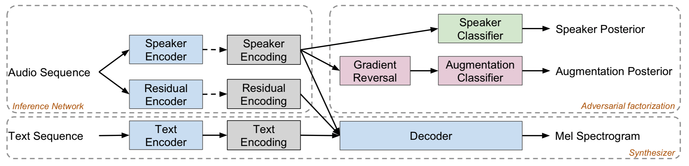
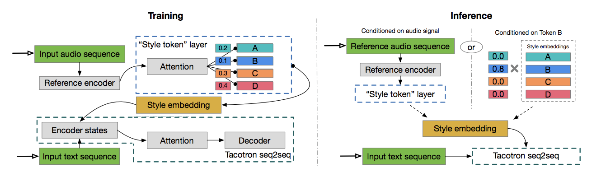
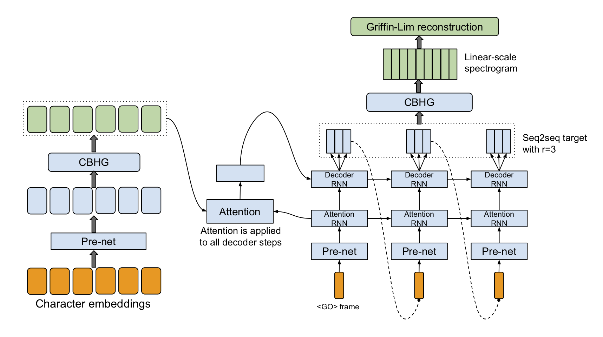

# Welcome to Poodle TTS

## Current model

Add TC1+GST(?)+Wavenet+Sample efficient speaker adaptation model when ready.

Schematic representation of whole model.

## Future Plans

## Q2

Data collection and Speaker adaptation

## Q3

Generate text in your own voice! app

## History 

## Feb 2019

### Noise-speaker disentangling

Based on [Google's paper](https://openreview.net/pdf?id=Bkg9ZeBB37)

<figure>
    <figcaption>KSS conditioned on itself / noised version of itself</figcaption>
    <audio controls><source src="audio/Adversarial/kss_on_itself.wav" type="audio/wav">Your browser does not support the audio element.</audio>
    <audio controls><source src="audio/Adversarial/kss_on_noised.wav" type="audio/wav">Your browser does not support the audio element.</audio>
</figure>

<figure>
    <figcaption>Zeroth speaker 97 conditioned on itself / KSS</figcaption>
    <audio controls><source src="audio/Adversarial/zeroth97_on_itself.wav" type="audio/wav">Your browser does not support the audio element.</audio>
    <audio controls><source src="audio/Adversarial/zeroth97_on_kss.wav" type="audio/wav">Your browser does not support the audio element.</audio>
</figure>

<figure>
    <figcaption>Zeroth speaker 10 conditioned on itself / KSS</figcaption>
    <audio controls><source src="audio/Adversarial/zeroth10_on_itself.wav" type="audio/wav">Your browser does not support the audio element.</audio>
    <audio controls><source src="audio/Adversarial/zeroth10_on_kss.wav" type="audio/wav">Your browser does not support the audio element.</audio>
</figure>

<figure>
    <figcaption>YTN (Unseen) conditioned on itself / KSS</figcaption>
    <audio controls><source src="audio/Adversarial/ytn_on_itself.wav" type="audio/wav">Your browser does not support the audio element.</audio>
    <audio controls><source src="audio/Adversarial/ytn_on_kss.wav" type="audio/wav">Your browser does not support the audio element.</audio>
</figure>

### Pitch and Tempo control

<figure>
  <figcaption>Speaker 1 (KSS)</figcaption>
  <audio controls><source src="audio/Pitch+Tempo/slow-low-speaker1.wav" type="audio/wav">Your browser does not support the audio element.</audio>
  <audio controls><source src="audio/Pitch+Tempo/fast-high-speaker1.wav" type="audio/wav">Your browser does not support the audio element.</audio>
</figure>

<figure>
  <figcaption>Speaker 2 (Zeroth)</figcaption>
  <audio controls><source src="audio/Pitch+Tempo/slow-low-speaker2.wav" type="audio/wav">Your browser does not support the audio element.</audio>
  <audio controls><source src="audio/Pitch+Tempo/fast-high-speaker2.wav" type="audio/wav">Your browser does not support the audio element.</audio>
</figure>

### Pausing

<figure>
<figcaption>Spacing</figcaption>
<audio controls><source src="audio/Pause/0-spaces.wav" type="audio/wav">Your browser does not support the audio element.</audio>
<audio controls><source src="audio/Pause/1-space.wav" type="audio/wav">Your browser does not support the audio element.</audio>
<audio controls><source src="audio/Pause/2-spaces.wav" type="audio/wav">Your browser does not support the audio element.</audio>
</figure>

<figure>
<figcaption>Comma</figcaption>
<audio controls><source src="audio/Pause/1-comma.wav" type="audio/wav">Your browser does not support the audio element.</audio>
<audio controls><source src="audio/Pause/2-commas.wav" type="audio/wav">Your browser does not support the audio element.</audio>
</figure>

### Word embeddings to improve data efficiency

### Wavenet

## ~Jan 2019

### Spectrogram-to-wav comparison

<figure>
  <figcaption>Only Griffin-Lim:</figcaption>
  <audio controls><source src="audio/GL+WSOLA/before.wav" type="audio/wav">Your browser does not support the audio element.</audio>
</figure>

<figure>
  <figcaption>With WSOLA postprocessing:</figcaption>
  <audio controls><source src="audio/GL+WSOLA/after.wav" type="audio/wav">Your browser does not support the audio element.</audio>
</figure>

### Multispeaker Tacotron with Global Style Tokens

This model is from Google's paper [Style Tokens: Unsupervised Style Modeling, Control and Transfer in
End-to-End Speech Synthesis](https://arxiv.org/pdf/1803.09017.pdf), modified by explicitly conditioning on speaker labels.

<figure>
  <figcaption>Multispeaker Samples:</figcaption>
  <audio controls><source src="audio/GST+Multispeaker/sadder/speaker27+sadder.wav" type="audio/wav">Your browser does not support the audio element.</audio>
  <audio controls><source src="audio/GST+Multispeaker/neutral/speaker5+neutral.wav" type="audio/wav">Your browser does not support the audio element.</audio>
  <audio controls><source src="audio/GST+Multispeaker/neutral/speaker30+neutral.wav" type="audio/wav">Your browser does not support the audio element.</audio>
  <audio controls><source src="audio/GST+Multispeaker/scared/speaker13+scared.wav" type="audio/wav">Your browser does not support the audio element.</audio>
</figure>

<figure>
 <figcaption>Mimic prosody with GST:</figcaption>
 <audio controls><source src="audio/GST+Multispeaker/mimic_prosody/sadder.wav" type="audio/wav">Your browser does not support the audio element.</audio>
 <audio controls><source src="audio/GST+Multispeaker/mimic_prosody/sadder_syn.wav" type="audio/wav">Your browser does not support the audio element.</audio>
</figure>

### Expressive Tacotron

This model is from Google's paper [Towards End-to-End Prosody Transfer for Expressive Speech Synthesis with Tacotron](https://arxiv.org/pdf/1803.09047.pdf)

<figure>
  <figcaption>Expressive Tacotron Samples:</figcaption>
  <audio controls><source src="audio/Expressive-Tacotron/kss-1.wav" type="audio/wav">Your browser does not support the audio element.</audio>
  <audio controls><source src="audio/Expressive-Tacotron/kss-2.wav" type="audio/wav">Your browser does not support the audio element.</audio>
  <audio controls><source src="audio/Expressive-Tacotron/ytn-fast.wav" type="audio/wav">Your browser does not support the audio element.</audio>
  <audio controls><source src="audio/Expressive-Tacotron/ytn-mad.wav" type="audio/wav">Your browser does not support the audio element.</audio>
  <audio controls><source src="audio/Expressive-Tacotron/ytn-slow.wav" type="audio/wav">Your browser does not support the audio element.</audio>
</figure>

<figure>
<figcaption>Corresponding Reference Audios:</figcaption>
<audio controls><source src="audio/Expressive-Tacotron/ref/kss-1.wav" type="audio/wav">Your browser does not support the audio element.</audio>
<audio controls><source src="audio/Expressive-Tacotron/ref/kss-2.wav" type="audio/wav">Your browser does not support the audio element.</audio>
<audio controls><source src="audio/Expressive-Tacotron/ref/ytn-fast.wav" type="audio/wav">Your browser does not support the audio element.</audio>
<audio controls><source src="audio/Expressive-Tacotron/ref/ytn-mad.wav" type="audio/wav">Your browser does not support the audio element.</audio>
<audio controls><source src="audio/Expressive-Tacotron/ref/ytn-slow.wav" type="audio/wav">Your browser does not support the audio element.</audio>
</figure>

### Baseline Tacotron

This model is from Google's paper [Tacotron: Towards End-to-End Speech Synthesis](https://arxiv.org/pdf/1703.10135.pdf)

<figure>
  <figcaption>Tacotron Sample:</figcaption>
  <audio controls><source src="audio/Tacotron/tacotron.wav" type="audio/wav">Your browser does not support the audio element.</audio>
</figure>

### DCTTS

Samples

